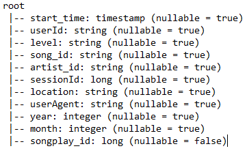
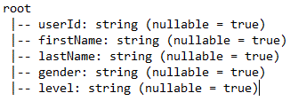
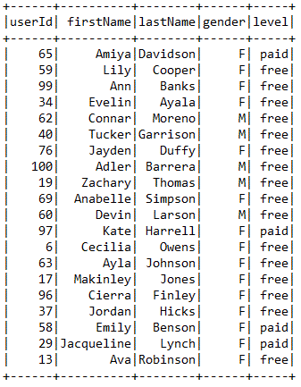
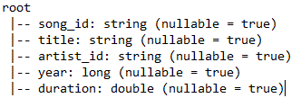
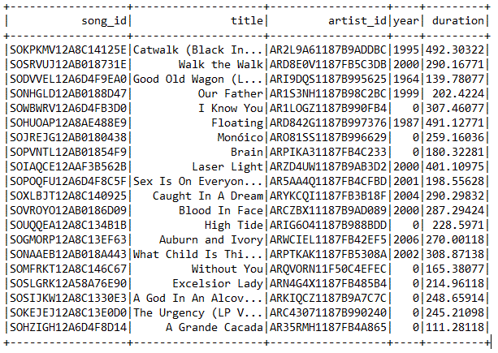
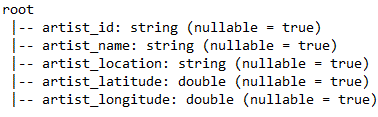
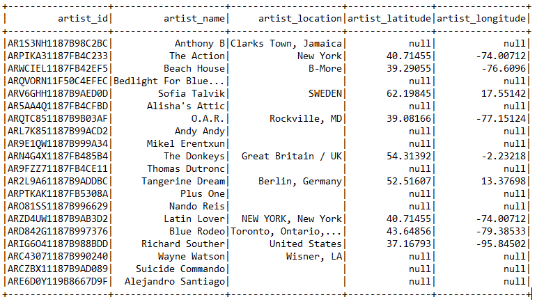
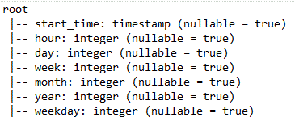
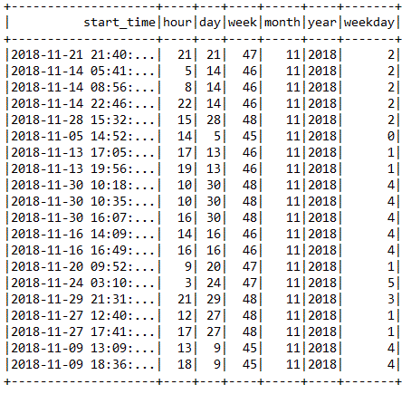

# Sparkify's Data Lake

The goal of this project is to create a datalake to collect songs and user activity on Sparkify streaming app. The ETL can import files from a S3 buckets of JSON logs on user activity and metadata of the songs in the Sparkify, using spark (pyspark).
It creates the tables in another S3 bucjet in parquet format

# Files

**README.md**: This File
**dwh.cfg**: Config File
**etl.py**: ETL pipeline to load the data into the Postgres Database

# How to Run

Load the tables from the S3 Bucket and create the Parquet tables by running
#python etl.py

You are read to go.

# Database Description

### songplays table
It contains records in log data associated with song plays.
Songplays table files are partitioned by year and month.

**songplays structure:**

### users table
It contains user records in the app (First and Last name) and the type of subscription they have (free or paid).

**users structure:**

**users sample:**

### songs table
Comprehensive list of songs in music database.
Songs table files are partitioned by year and then artist.

**songs structure:**

**songs sample:**

### artists table
Comprehensive list of artists in music database, including location.

**artists structure:**

**artists sample:**

### time table
Timestamps of records in songplays broken down into specific units.
Time table files are partitioned by year and month

**time structure:**

**time sample:**

